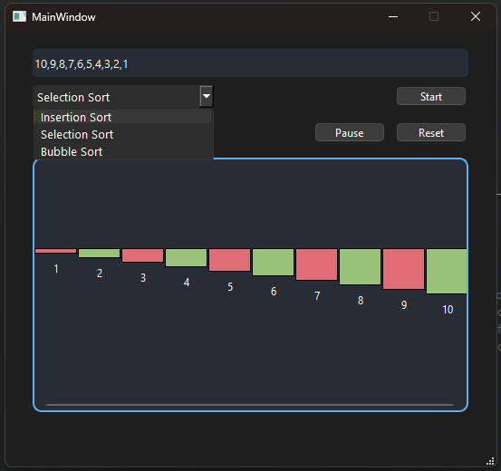

Sure! Here's a detailed `README.md` file for your Sorting Visualizer project. This template includes sections for project description, features, installation, usage, and contribution guidelines.

```markdown
# Sorting Visualizer

Sorting Visualizer is a desktop application that visually demonstrates how different sorting algorithms work. This tool provides an educational experience by allowing users to see the step-by-step process of various sorting algorithms through animations.

## Features

- **Sorting Algorithms**: Visualize the following sorting algorithms:
  - Bubble Sort
  - Selection Sort
  - Insertion Sort
  - Merge Sort (optional, can be added)
  - Quick Sort (optional, can be added)
- **Real-Time Visualization**: Watch the array elements move and sort in real-time.
- **Control Panel**: Start, pause, and reset the visualization.
- **Customization**: Adjust the speed of the visualization and input custom arrays.

## Screenshots



## Installation

### Prerequisites

- [Qt Creator](https://www.qt.io/download) (with Qt libraries)
- [Git](https://git-scm.com/)

### Clone the Repository

```sh
git clone https://github.com/MuhammadHuzaifa-stu/Sorting_Visualizer.git
cd Sorting_Visualizer
```

### Open in Qt Creator

1. Launch Qt Creator.
2. Open the project by selecting `File` -> `Open File or Project` and choose the `.pro` file in the repository.
3. Build and run the project.

## Usage

1. **Start the Application**: Run the application from Qt Creator.
2. **Input Array**: Enter the array elements separated by commas in the input field.
3. **Select Algorithm**: Choose the sorting algorithm from the dropdown menu.
4. **Control Visualization**:
   - **Start**: Begin the visualization.
   - **Pause**: Pause the visualization.
   - **Reset**: Reset the visualization to the initial state.
5. **Adjust Speed**: Use the slider to adjust the speed of the visualization.

## Contributing

Contributions are welcome! Follow these steps to contribute:

1. **Fork the Repository**: Click on the `Fork` button at the top of this repository.
2. **Clone Your Fork**: 
   ```sh
   git clone https://github.com/your-username/Sorting_Visualizer.git
   cd Sorting_Visualizer
   ```
3. **Create a Branch**: 
   ```sh
   git checkout -b feature-branch
   ```
4. **Make Your Changes**: Implement your feature or fix.
5. **Commit Your Changes**: 
   ```sh
   git add .
   git commit -m "Describe your changes"
   ```
6. **Push to Your Fork**: 
   ```sh
   git push origin feature-branch
   ```
7. **Submit a Pull Request**: Go to the original repository and submit a pull request.

## License

This project is licensed under the MIT License - see the [LICENSE](LICENSE) file for details.

## Acknowledgments

- Thanks to the Qt community for providing an excellent framework for C++ application development.
- Special thanks to all contributors and users of this project.

## Contact

For any questions or suggestions, feel free to open an issue or contact the repository owner at [your-email@example.com].

---

*This `README.md` was generated by [ChatGPT](https://openai.com/chatgpt).*
```

You can customize the `README.md` further based on your project's specifics and any additional features you add. Make sure to replace placeholder email and other personal details with your actual information.
